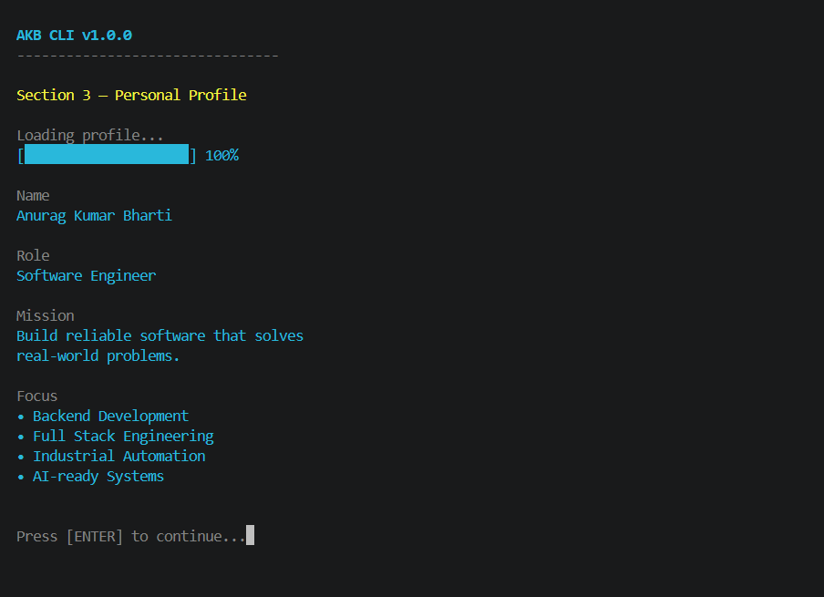
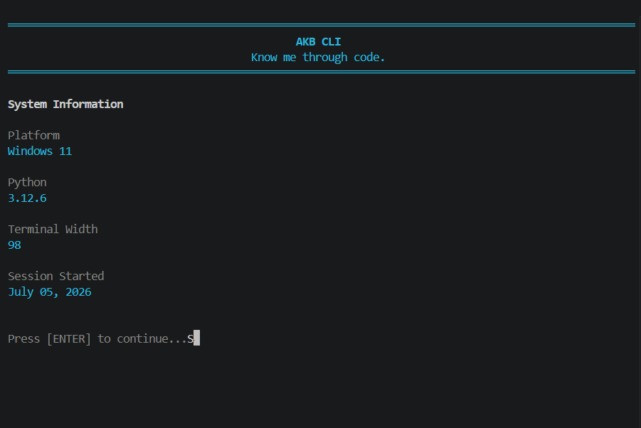
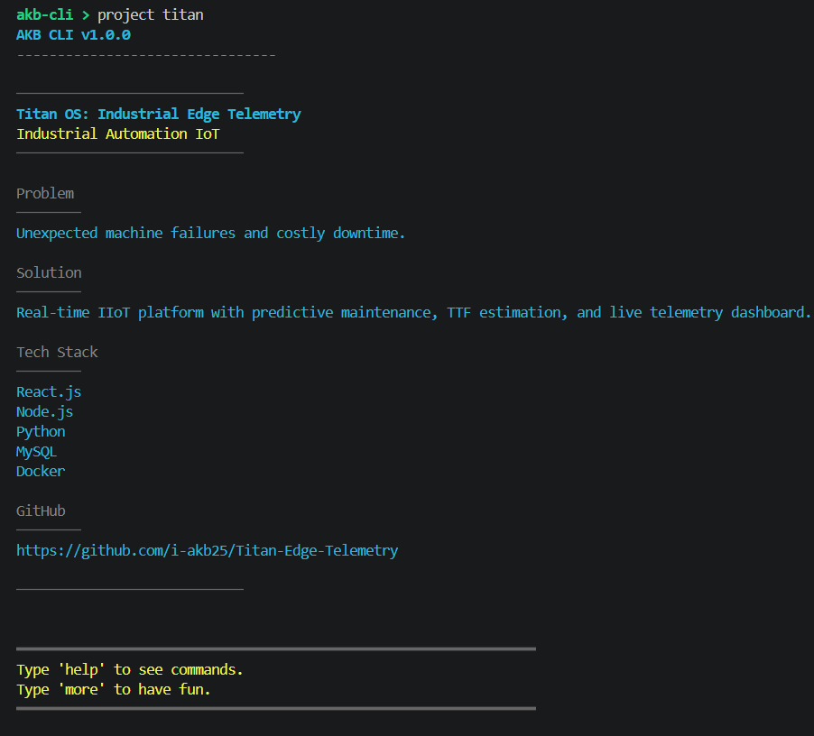
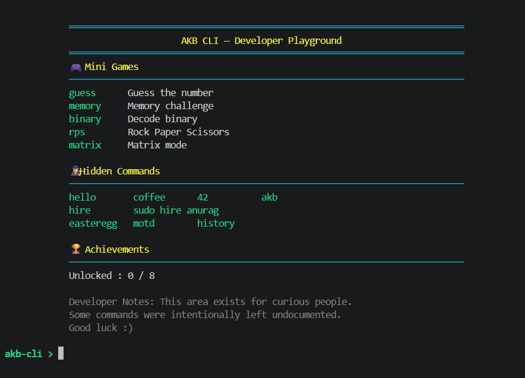
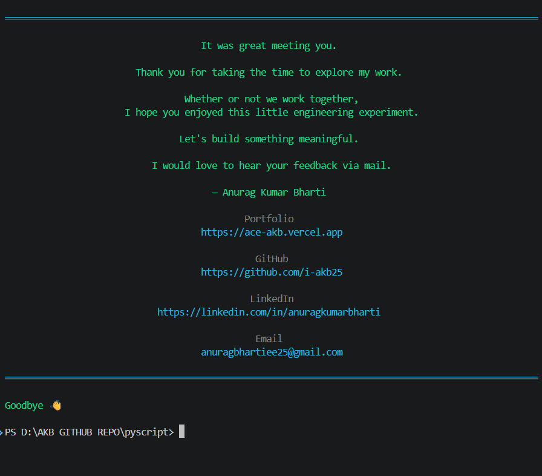

# AKB CLI

<p align="center">
  <h3>Know me through code.</h3>
  <p><b>An Interactive Terminal-Based Portfolio Built with Python</b></p>
  <p>Instead of introducing myself through another document, I built an interactive command-line experience that tells my story as an engineer through code.</p>

  
  
  
  
</p>

---

## Preview



---

## About

AKB CLI is an interactive command-line portfolio that presents my professional journey in a unique and engaging way.

Rather than reading another static résumé, visitors can explore my background, projects, skills, engineering philosophy, and contact information through an interactive terminal interface.

The goal was to create something that reflects how I think as an engineer—building experiences, not just documents.

---

## Features

### Interactive Experience
- Interactive startup animation
- Simulated terminal boot sequence
- Typing animations
- Dynamic loading screen
- Cross-platform support
- Responsive terminal layout

### Personal Portfolio
- About Me
- Education
- Experience
- Skills
- Engineering Philosophy
- Contact Information
- Portfolio Launcher

### Project Showcase
Explore projects including:
- ADHAYAN
- Titan OS
- Drone Delivery System
- Portfolio Website

Each project includes:
- Problem Statement
- Solution
- Technology Stack
- Project Overview

### Developer Playground
The hidden **more** section contains:
- Easter Eggs
- Secret Commands
- Mini Interactive Experiences
- Inspirational Quotes
- Fun Terminal Interactions

### User Experience
- ANSI Colors
- Command History
- Professional Exit Sequence
- Graceful Error Handling
- Keyboard Interrupt Handling
- Modular Architecture
- Lightweight Execution

---

## Screenshots

### Startup


### About


### Projects


### Details


### Developer Playground


### Exit Screen


---

## Installation

Clone the repository:
```bash
git clone https://github.com/i-akb25/akb-cli.git
```

Move into the project:
```bash
cd akb-cli
```

**(Optional)** Create a virtual environment:
```bash
python -m venv venv
```

Activate it:

**Windows**
```bash
venv\Scripts\activate
```

**macOS / Linux**
```bash
source venv/bin/activate
```

Install dependencies:
```bash
pip install -r requirements.txt
```

Run the application:
```bash
python about_akb.py
```

---

## Requirements

- Python 3.10+
- No external dependencies
- Uses only Python Standard Library

---

## Available Commands

| Command | Description |
|----------|-------------|
| `about` | View personal profile |
| `education` | Education details |
| `experience` | Professional experience |
| `skills` | Technical skills |
| `projects` | View all projects |
| `project <name>` | Open a specific project |
| `philosophy` | Engineering philosophy |
| `contact` | Contact information |
| `portfolio` | Open portfolio website |
| `resume` | Resume shortcut |
| `help` | Display help |
| `clear` | Clear terminal |
| `exit` | Exit application |

---

## Hidden Features

The application contains several hidden commands.

**Hint:**  
Try typing:
```
hello
coffee
42
more
```

Can you discover them all?

---

## Project Structure

```text
akb-cli/
│
├── about_akb.py
├── README.md
├── LICENSE
├── requirements.txt
├── .gitignore
│
├── assets/
│   ├── startup.png
│   ├── about.png
│   ├── details.png
│   ├── exit.png
│   ├── help.png
│   ├── projects.png
│   ├── more.png
│   └── goodbye.png
│
└── docs/
    └── CHANGELOG.md
```

---

## Technical Details

**Language:** Python  
**Architecture:** Modular Command-Line Application  
**Dependencies:** Python Standard Library  
**Platform Support:** Windows, macOS, Linux  

---

## Why I Built This

Most portfolios focus on presenting information.

I wanted to create an experience.

AKB CLI represents my belief that software engineering is about solving problems creatively and delivering meaningful user experiences. Rather than introducing myself through another document, I built an interactive application that demonstrates my technical skills, attention to detail, and passion for engineering.

---

## Roadmap

### Version 2

Planned improvements include:
- Enhanced startup animations
- Multiple terminal themes
- Interactive timeline
- Achievement system
- Save progress
- More mini games
- Additional Easter Eggs
- Plugin architecture
- Better accessibility
- Improved project explorer

---

## Author

**Anurag Kumar Bharti**  
Software Engineer

- **Portfolio:** [https://ace-akb.vercel.app](https://ace-akb.vercel.app)
- **GitHub:** [https://github.com/i-akb25](https://github.com/i-akb25)
- **LinkedIn:** [https://linkedin.com/in/anuragkumarbharti](https://linkedin.com/in/anuragkumarbharti)
- **Email:** anuragbhartiee25@gmail.com

---

## License

This project is licensed under the MIT License. See the **LICENSE** file for details.

---

<p align="center">
  <h3>Know me through code.</h3>
  <p>If you enjoyed exploring AKB CLI, feel free to ⭐ the repository.</p>
  <p>Thank you for visiting!</p>
</p>

